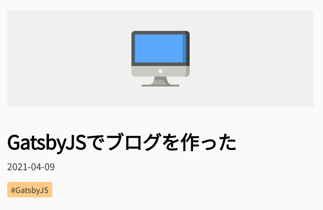

# やりたいこと
gatsby.jsで作ったブログで、記事ごとにいちいちアイキャッチを設定するのが面倒・・・。  
そこで、記事のカテゴリ名に応じて自動でアイキャッチがつくようにした。

# 環境
- Gatsby 3.1.2
- Gatsby CLI 3.3.0
- node 15.10.0
- ホスティングサービスはNetlifyを利用

# 完成したもの
記事のMarkdownファイル

```
---
title: "GatsbyJSでブログを作った"
date: "2021-04-09 07:53:46"
description: "GatsbyJSでブログを作った"
tags: ['#GatsbyJS']
category: "dev"
---
```

実際の画面



背景色は固定で、アイキャッチ用のアイコンを自動的に表示させている。  
このiMacみたいなアイコンのファイル名は`dev.svg`。  
YAMLで書いている`category: "dev"`と名称を合わせている。


## 実際の処理
ディレクトリ構造は以下の通り。（一部のみ抜粋）

```
├─ src/ .................. 
~~
│  ├─ images/ ............ 
│  │  └─ eyecatch/ ....... アイキャッチ用ディレクトリ
│  │     └─ dev.svg ...... 画像ファイル
│  ├─ templates/ ......... 
│  │  ├─ blog-post.js .... 記事用テンプレート
~~
```
`blog-post.js`は下記のように記述している。

``` js
import * as React from "react"
import { graphql } from "gatsby"

const BlogPostTemplate = ({ data }) => {
  const post = data.markdownRemark
  const eyecatch = data.allFile.nodes.find( file => file.name === post.frontmatter.category)?.publicURL // GraphQLから取得したカテゴリ名と一致する画像ファイルのpublicURLを取得

  return (

    // 該当部分のみ抜粋

    
  )
}

export default BlogPostTemplate

export const pageQuery = graphql`
  query BlogPostBySlug(
    $id: String!
  ) {
    markdownRemark(id: { eq: $id }) {
      id
      excerpt(pruneLength: 160)
      html
      frontmatter {
        title
        date(formatString: "YYYY-MM-DD")
        description
        tags
        category
      }
    }
    allFile(filter: {relativeDirectory: {eq: "eyecatch"}}) {
      nodes {
        name
        publicURL
      }
    }
  }
`
```

カテゴリを増やす際に、アイキャッチの画像もあわせて準備しておけば、あとは自動で表示してくれる。
