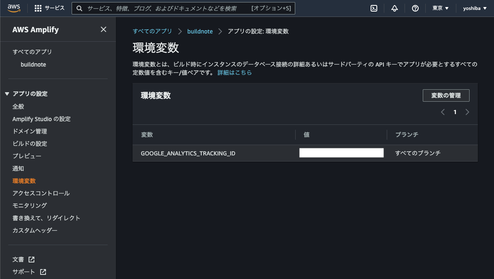

## やりたいこと
`Gatsby.js` で作成したサイトを`AWS Amplify`でホスティングした際、環境変数のエラーが出た。  
`gatsby-config.js`内でGoogle Analyticsの環境変数を読み込むように設定しており、普段はホスティングしているNetlify側で設置を行っている。

```js:title=gatsby-config.js
plugins: [
    {
      resolve: `gatsby-plugin-google-analytics`,
      options: {
        trackingId: process.env.GOOGLE_ANALYTICS_TRACKING_ID,
        head: true,
        respectDNT: true,
      },
    },
    …
```

この`GOOGLE_ANALYTICS_TRACKING_ID` をAWS側で設定しデプロイ時に読み込ませるようにしたい。

## やったこと
管理画面で環境変数の設定を行う。



環境変数を読み込む設定を `amplify.yml` に追記する。

```yml:title=amplify.yml
version: 1
frontend:
  phases:
    preBuild:
      commands:
        - npm install
    build:
      commands:
        - gatsby build
        # 以下の1行を追記
        - echo "GOOGLE_ANALYTICS_TRACKING_ID=$GOOGLE_ANALYTICS_TRACKING_ID" >> .env
  artifacts:
    baseDirectory: public
    files:
      - '**/*'
  cache:
    paths:
      - node_modules/**/*
```

あとはGithubにpushしてあげればビルド時に環境変数を読み込んくれる。

## 余談
今回、初めてAWSを使ってみたが、手軽にアプリケーションをデプロイできていい感じ。
昔使っていたレンタルサーバにおいているポートフォリオもこっちに移行してもいいかもしれない。  
